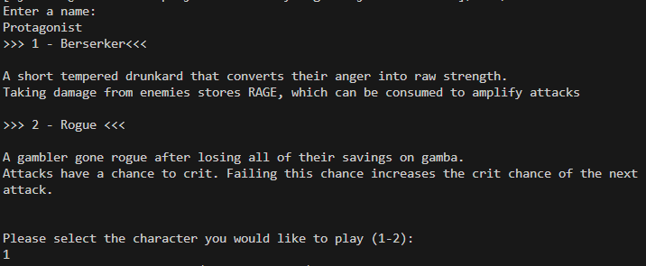
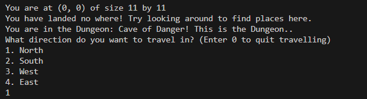
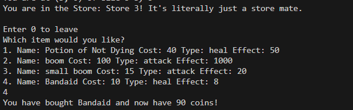
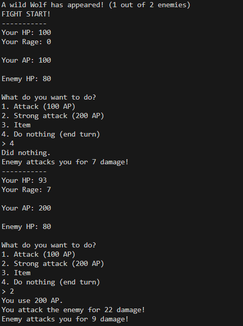
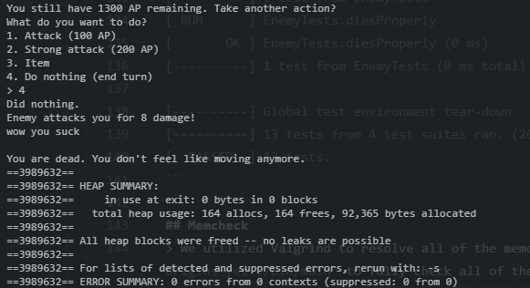

[](https://classroom.github.com/online_ide?assignment_repo_id=10951446&assignment_repo_type=AssignmentRepo)
 > As you complete each section you **must** remove the prompt text. Every *turnin* of this project includes points for formatting of this README so keep it clean and keep it up to date. 
 > Prompt text is any lines beginning with "\>"
 > Replace anything between \<...\> with your project specifics and remove angle brackets. For example, you need to name your project and replace the header right below this line with that title (no angle brackets). 
# Fleecing Fate: Wooly Retribution
## A Narrative-Driven Text-Based Role Playing Game 
 
 > Authors: [Falak Tulsi](https://github.com/Tech13-08),[Yat Chun Wong](https://github.com/ywong042),[Andy Jarean](https://github.com/ajarean),[Tingxuan Wu](https://github.com/twu148)

## Project Description
> **Game Overview:**
> This program is a narrative-driven text-based roleplaying game, in which a sheep farmer gets revenge on the wolves that kidnapped all the sheep in their town. At first, the player is prompted with two player options: Berserker and Rogue, who have different attacks and stats. 
> After the player leaves the village, they must overcome several wolf-infested dungeons while clearing all of the wolves inside. To win the game, the player must avenge the fallen sheep by clearing the very last room at the end. 
> An important aspect of this game is the item and inventory features, which are crucial to beating the game.
> **Why we chose this:**
> The reason we chose to make a Text-Based RPG is because the idea allows more room for creativity relative to other ideas for this project. From the characters to the story line, we look forward to making them flow together. 
>
> Naturally, an RPG is very open-ended which allows us to write virtually any story we would like to. Additionally, taking the concept of an RPG and limiting it to the terminal environment also piques our interest as developers. 
> 
> At this beginning stage of the project, we plan to develop the game using the C++ language in the Visual Studio Code IDE. For our version control, we plan to use git and maintain the project through Github. 
>
> We plan to make the input for our game be the user entering a letter/number to chose one of the options presented at any moment of the game. The output would be a string of text generated by our program that explains the state of the game based on the user's choice. 
>
> The features we included for this game are the following:
> * `Items System`: Throughout the game, the user will have chances to get items each with their own ability. These items will include stat-increasing items such as healing potions and items which deal damage to opponents.
> * `Turn Based Battle`: As the user progresses in the game, they will encounter enemies to battle. The flow of combat will involve the player and the enemy taking turns performing actions. These battles will utilize an "AP," or action point system, in which the player is given AP every turn, and actions cost AP. The moves themselves will consist of normal attacks, heavy attacks, use item, or do nothing. The latter two moves cost 0 AP.
> * `Locations`: The game will have multiple locations the user can travel to, each with their own purpose. These locations will consist of villages with shops, dungeons with enemies, etc.
> * `Story Line`: The game features a storyline that is ultimately linear, but gives the player the freedom to traverse around the map and make decisions at their own pace. The story concludes when the user defeats the final boss and achieves the protagonist's goal.
> 
> The following extra specifications have been done, as time allowed:
>
> * `Character Selection`: At the start of the journey, the user will be able to select one of many characters who differ in weapons, armors, and special abilities.
> 
> The following specifications have been planned but ultimately cut, either due to time constraints or changes in planning.
> 
> * `Leveling System`: As the user continues their journey and battle more foes, they will gain experience points allowing them to level up. Each time they level up, the user will be granted upgraded stats for their character along with a chance for a special item.
> The leveling system was cut because the game was too short, and the player would not have adequate time to meaningfully acquire experience.
> * `Improved Battle System`: Some enemies may have weaknesses which the player can exploit during combat to gain an advantage, such as delaying the enemy's turn or dealing additional damage. This adds an extra tactical layer to combat.
> This improved battle system was cut because due to the story of the game, we only included one type of enemy, which would have the same weaknesses.
 > ## Phase II
 > We created three Epics that go over the main features and core aspects of our Text-Based Adventure Game. The first Epic goes over the how the Battle System should look like and the second Epic goes over the Character System. The last Epic goes over Locations of the game. 
 > The three Epics were split into six user stories so that we can work on them over the next several weeks and assign to team members during the scrum meeting.
## User Interface Specification

### Navigation Diagram

> Our navigation diagram [here](images/NavDiagram.png) represents how each screen of the game transitions to the next, as well as the overall flow of the game. The player begins at the character selection screen, in which they are prompted to choose between a Berserker or Rogue. From there, the player may traverse through the village and dungeon maps. In the village, the player may buy items from the shops and in the dungeon, the player may encounter enemies to battle. The player wins the game when they defeat the final boss and reach the end of the dungeon. However, the player dies when they fall in combat. 

### Screen Layouts
> Our screen layouts [here](images/ScreenDesign.pdf) illustrate our in-program screens and buttons. When the player starts the game, the very first screen is the Title screen, which gives the player options to read the tutorial or select a character. The player receives prompts and selects numerical options using the keyboard input to progress through the game. When moving through the world, the player is given a coordinate and four directions they can move in. The combat screens all share the same layout, but may have different enemies depending on the stage of the game you are in.

## Class Diagram

> Our UML class diagram [here](images/UML_Class_Diagram.png) represents the various classes we will implement in our project and how they will fit together. The diagram highlights the relationships between the classes and gives an overall idea of how the game will function. The player and enemy, for example, will both originate from the parent Character class. The Location class divides into the Dungeon, Village, Store, and Dungeon Room classes, which together become the map for the game. The Dungeon Room will have either enemies or items: both of which are classes with their own parameters and functions. The Game class is how we will manage all of these relationships at once to provide smooth game functionality.
 
 > ## Phase III
> We applied Integration Segregation principle to the Exp variable in the Character class since the subclasses Enemy and Boss do not need to inherit Exp from the character. We applied the principle by removing the Exp variable and the Exp methods in the class and also in its following subclasses in Enemy and Boss Enemy. This change removes unnecessary methods in the sub-classes and also reduces the possibility of those bugs.

> We applied Single Responsibility Principle in the Game class since it originally violated the principle by having the Battle System in the same class. We applied the principle by creating a new class to have the Battle System and removed the function in the Game class. This change gives the class only one responsibilities and separates bugs from Battle Systems if it does occurs.

> We used Listov Subistution in the Enemy and Boss subclasses. This works by having the subclasses have all the functionalities of the parent class Character. By doing so, we create a consistency so that we can use child and the parent the same way without creating an error.

> We used Single Responsibility Principle in the Enemy and Boss subclasses. The two subclasses do different jobs and are distinct enough from each other so we separated them into two child classes of Character. By doing so, we separate behaviors that don't have anything to do with each other, making it easier to debug if an issue arises in those areas of code.

> We have also used Single Responsibility Principle in the Location class and its subclasses. Every class there has one job only and do not contain behaviors from other classes. This makes it easier to develop Locations since each class does exactly as it is named and does not have any strange behaviors combined with it.
 
 > ## Final deliverable
 ### Screenshots
 
 > The player is greeted by the option to select a character class.
 
 > A sample of the movement input/output
 
 > A sample of the store screen
 
 > A sample of the battle screen
 ### Installation/Usage
 > Use git to clone the repository, and ensure that you switch into the repository.
 ```
 git clone https://github.com/cs100/final-project-ftuls001-ywong042-ajare002-twu148.git
 cd final-project-ftuls001-ywong042-ajare002-twu148
 ```
 > Since the repository does not contain the executable file itself, you will need to compile the code and make the executable using cmake.
 ```
 cmake .
 make
 ```
 > Afterwards, the main executable will be in the bin folder.
 ```
 bin/main
 ```
 > Enjoy! 

 ### Testing
 > For each main branch of the project (battles, movements, characters, etc.), we used Google Tests to run unit tests in order to ensure that each component worked individually before it could be merged. Here is a sample of some of the Google Tests. For the sake of brevity, some of the output (namely, the Battle code outputs responding to user inputs) has been omitted. 
```
[==========] Running 13 tests from 4 test suites.
[----------] Global test environment set-up.
[----------] 6 tests from MapTests
[ RUN      ] MapTests.SmallSizeUnderMax
[       OK ] MapTests.SmallSizeUnderMax (0 ms)
[ RUN      ] MapTests.SmallSizeOverMin
[       OK ] MapTests.SmallSizeOverMin (0 ms)
[ RUN      ] MapTests.BigSizeUnderMax
[       OK ] MapTests.BigSizeUnderMax (0 ms)
[ RUN      ] MapTests.BigSizeOverMin
[       OK ] MapTests.BigSizeOverMin (0 ms)
[ RUN      ] MapTests.NotInRange
[       OK ] MapTests.NotInRange (0 ms)
[ RUN      ] MapTests.InRange
[       OK ] MapTests.InRange (0 ms)
[----------] 6 tests from MapTests (0 ms total)

[----------] 3 tests from BattleTests
[ RUN      ] BattleTests.Constructor
[       OK ] BattleTests.Constructor (0 ms)
[ RUN      ] BattleTests.WinCondition
[       OK ] BattleTests.WinCondition (17847 ms)
[ RUN      ] BattleTests.LoseCondition
[       OK ] BattleTests.LoseCondition (8926 ms)
[----------] 3 tests from BattleTests (26774 ms total)

[----------] 3 tests from BerserkerTests
[ RUN      ] BerserkerTests.rageTest
[       OK ] BerserkerTests.rageTest (0 ms)
[ RUN      ] BerserkerTests.rageLostTest
[       OK ] BerserkerTests.rageLostTest (0 ms)
[ RUN      ] BerserkerTests.statCapTest
[       OK ] BerserkerTests.statCapTest (0 ms)
[----------] 3 tests from BerserkerTests (0 ms total)

[----------] 1 test from EnemyTests
[ RUN      ] EnemyTests.diesProperly
[       OK ] EnemyTests.diesProperly (0 ms)
[----------] 1 test from EnemyTests (0 ms total)

[----------] Global test environment tear-down
[==========] 13 tests from 4 test suites ran. (26774 ms total)
[  PASSED  ] 13 tests.
```
### Memcheck
 > We used Valgrind to resolve our memory errors. Specifically we ran `$ valgrind --leak-check=full --track-origins=yes ./bin/main` to fully check our memory leaks and track where they originated. Here is a sample of what our Valgrind output looks like:

