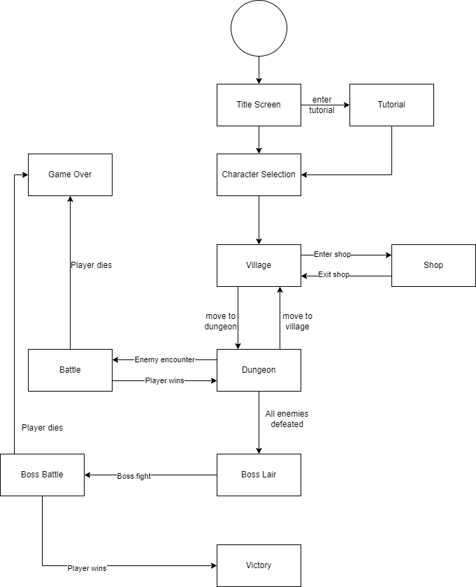

 > As you complete each section you **must** remove the prompt text. Every *turnin* of this project includes points for formatting of this README so keep it clean and keep it up to date. 
 > Prompt text is any lines beginning with "\>"
 > Replace anything between \<...\> with your project specifics and remove angle brackets. For example, you need to name your project and replace the header right below this line with that title (no angle brackets). 
# Narrative-Driven Text-Based Role Playing Game (Tentative)
 
 > Authors: [Falak Tulsi](https://github.com/Tech13-08),[Yat Chun Wong](https://github.com/ywong042),[Andy Jarean](https://github.com/ajarean),[Tingxuan Wu](https://github.com/twu148)

## Project Description
> The reason we chose to make a Text-Based RPG is because the idea allows more room for creativity relative to other ideas for this project. From the characters to the story line, we look forward to making them flow together. 
>
> Naturally, an RPG is very open-ended which allows us to write virtually any story we would like to. Additionally, taking the concept of an RPG and limiting it to the terminal environment also piques our interest as developers. 
> 
> At this beginning stage of the project, we plan to develop the game using the C++ language in the Visual Studio Code IDE. For our version control, we plan to use git and maintain the project through Github. 
>
> We plan to make the input for our game be the user entering a letter/number to chose one of the options presented at any moment of the game. The output would be a string of text generated by our program that explains the state of the game based on the user's choice. 
>
> The features we plan to include for this game are the following:
> * `Items System`: Throughout the game, the user will have chances to get items each with their own ability. These items will include stat-increasing items such as healing potions and attack-increasing potions, as well as items for progression such as keys to unlock doors.
> * `Turn Based Battle`: As the user progresses in the game, they will encounter enemies to battle. The battle will go back and forth between the user's move and the enemy's move. The moves themselves will generally consist of normal attack, heal, use item, heavy attack, or escape.
> * `Locations`: The game will have multiple locations the user can travel to, each with their own purpose. These locations will consist of villages with shops, dungeons with enemies, etc.
> * `Story Line`: The game will a story line where the user may make choices to progress, but is ultimately linear. Wrong choices will delay the story, but may benefit the user with additional stats/items. The story concludes when the user resolves the final conflict and achieves the protagonist's goal.
> 
> The below specifications will be done if time allows:
>
> * `Character Selection`: At the start of the journey, the user will be able to select one of many characters who differ in weapons, armors, and special abilities. 
> * `Leveling System`: As the user continues their journey and battle more foes, they will gain experience points allowing them to level up. Each time they level up, the user will be granted upgraded stats for their character along with a chance for a special item.
> * `Improved Battle System`: Some enemies may have weaknesses which the player can exploit during combat to gain an advantage, such as delaying the enemy's turn or dealing additional damage. This adds an extra tactical layer to combat.
 > ## Phase II
 > We created three Epics that go over the main features and core aspects of our Text-Based Adventure Game. The first Epic goes over the how the Battle System should look like and the second Epic goes over the Character System. The last Epic goes over Locations of the game. 
 > The three Epics were split into six user stories so that we can work on them over the next several weeks and assign to team members during the scrum meeting.
## User Interface Specification

### Navigation Diagram

> Our navigation diagram [here](images/NavDiagram.png) represents how each screen of the game transitions to the next, as well as the overall flow of the game. The player begins at the main menu, at which they can decide to read a brief tutorial to learn about the game world and how to play it, or begin the game. From there, the player may progress from the village to the field and end at the dungeon. In each zone, players may interact with objects in the world (i.e. open doors, inspect the environment, etc). The player wins the game when they reach they defeat the final boss and reach the end of the dungeon. 

### Screen Layouts

> Our screen layouts [here](images/ScreenDesigns.pdf) illustrate our in-program screens and buttons. When the player starts the game, the very first screen is the Menu screen, which gives the player options to start and to quit. The player receives prompts and selects numerical options using the keyboard input to progress through the game. The combat screens all share the same layout, but have different enemies depending on the location the combat starts in.

## Class Diagram

> Our UML class diagram [here](images/UML_Class_Diagram.png) represents the various classes we will implement in our project and how they will fit together. The diagram highlights the relationships between the classes and gives an overall idea of how the game will function. The player and enemies, for example, will both originate from the parent Character class. The Location class divides into the Dungeon, Village, Store, and Dungeon Room classes, which together become the map for the game. The Dungeon Room will have either enemies or items: both of which are classes with their own parameters and functions. The Game class is how we will manage all of these relationships at once to provide smooth game functionality.
 
 > ## Phase III
 > You will need to schedule a check-in for the second scrum meeting with the same reader you had your first scrum meeting with (using Calendly). Your entire team must be present. This meeting will occur on week 8 during lab time.
 
 > BEFORE the meeting you should do the following:
 > * Update your class diagram from Phase II to include any feedback you received from your TA/grader.
 > * Considering the SOLID design principles, reflect back on your class diagram and think about how you can use the SOLID principles to improve your design. You should then update the README.md file by adding the following:
 >   * A new class diagram incorporating your changes after considering the SOLID principles.
 >   * For each update in your class diagram, you must explain in 3-4 sentences:
 >     * What SOLID principle(s) did you apply?
 >     * How did you apply it? i.e. describe the change.
 >     * How did this change help you write better code?
 > * Perform a new sprint plan like you did in Phase II.
 > * You should also make sure that your README file (and Project board) are up-to-date reflecting the current status of your project and the most recent class diagram. Previous versions of the README file should still be visible through your commit history.
 
> During the meeting with your reader you will discuss: 
 > * How effective your last sprint was (each member should talk about what they did)
 > * Any tasks that did not get completed last sprint, and how you took them into consideration for this sprint
 > * Any bugs you've identified and created issues for during the sprint. Do you plan on fixing them in the next sprint or are they lower priority?
 > * What tasks you are planning for this next sprint.

 
 > ## Final deliverable
 > All group members will give a demo to the reader during lab time. ou should schedule your demo on Calendly with the same reader who took your second scrum meeting. The reader will check the demo and the project GitHub repository and ask a few questions to all the team members. 
 > Before the demo, you should do the following:
 > * Complete the sections below (i.e. Screenshots, Installation/Usage, Testing)
 > * Plan one more sprint (that you will not necessarily complete before the end of the quarter). Your In-progress and In-testing columns should be empty (you are not doing more work currently) but your TODO column should have a full sprint plan in it as you have done before. This should include any known bugs (there should be some) or new features you would like to add. These should appear as issues/cards on your Project board.
 > * Make sure your README file and Project board are up-to-date reflecting the current status of your project (e.g. any changes that you have made during the project such as changes to your class diagram). Previous versions should still be visible through your commit history. 
 
 ## Screenshots
 > Screenshots of the input/output after running your application
 ## Installation/Usage
 > Instructions on installing and running your application
 ## Testing
 > How was your project tested/validated? If you used CI, you should have a "build passing" badge in this README.
 
